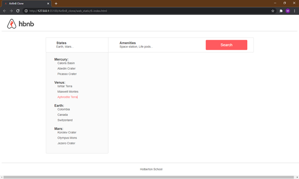

# 0x01. AirBnB clone - Web static

>Static web index page for AirBnB clone project.
This is the blueprint for the front page of the AirBnB project.

## Usage

Open any html file with any browser or with a local server implemented.

## Tasks :page_with_curl:

### Mandatory

* **0. Inline styling:**\
HTML page with simple header and footer usin inline style.

  * Files:
    * **[0-index.html](./0-index.html)**
* **1. Head styling:**\
HTML page with same layout as before but now using style tag.

  * Files:
    * **[1-index.html](./1-index.html)**
* **2. CSS files:**\
HTML page with same layout as before but now using CSS files.

  * Files:
    * **[2-index.html](./2-index.html)**
    * **[2-common.css](./styles/2-common.css)**: for global style.
    * **[2-header.css](./styles/2-header.css)**: for header style.
    * **[2-footer.css](./styles/2-footer.css)**: for footer style.
* **3. Zoning done!:**\
Index page with styles for footer and header.

  * Files:
    * **[3-index.html](./3-index.html)**
    * **[3-common.css](./styles/3-common.css)**: for global style.
    * **[3-header.css](./styles/3-header.css)**: for header style.
    * **[3-footer.css](./styles/3-footer.css)**: for footer style.
    * **[images](./images)**: Images implemented in index page.

* **4. Search!:**\
Index page with styles for footer and header, now with filters section for searching commodities.

  * Files:
    * **[4-index.html](./4-index.html)**
    * **[4-common.css](./styles/4-common.css)**: for global style.
    * **[3-header.css](./styles/3-header.css)**: for header style.
    * **[3-footer.css](./styles/3-footer.css)**: for footer style.
    * **[4-filters.css](./styles/4-filters.css)**: for filters style.
    * **[images](./images)**: Images implemented in index page.

* **5. More filters:**\
Index page with styles for footer and header, now with filters section for searching commodities and recommended filters boxes.

  * Files:
    * **[5-index.html](./5-index.html)**
    * **[4-common.css](./styles/4-common.css)**: for global style.
    * **[3-header.css](./styles/3-header.css)**: for header style.
    * **[3-footer.css](./styles/3-footer.css)**: for footer style.
    * **[4-filters.css](./styles/5-filters.css)**: for filters style.
    * **[images](./images)**: Images implemented in index page.

* **6. It's (h)over**\
Index page with styles for footer and header, now with filters section for searching commodities and recommended filters boxes and dropdowns menu for recommended filters.

  * Files:
    * **[6-index.html](./6-index.html)**
    * **[4-common.css](./styles/4-common.css)**: for global style.
    * **[3-header.css](./styles/3-header.css)**: for header style.
    * **[3-footer.css](./styles/3-footer.css)**: for footer style.
    * **[6-filters.css](./styles/6-filters.css)**: for filters style.
    * **[images](./images)**: Images implemented in index page.

* **7. Display results**\
Index page with styles for footer and header, now with filters section for searching commodities, recommended filters boxes, dropdowns menu for recommended filters and results displayed.

  * Files:
    * **[7-index.html](./7-index.html)**
    * **[4-common.css](./styles/4-common.css)**: for global style.
    * **[3-header.css](./styles/3-header.css)**: for header style.
    * **[3-footer.css](./styles/3-footer.css)**: for footer style.
    * **[6-filters.css](./styles/6-filters.css)**: for filters style.
    * **[7-places.css](./styles/7-places.css)**: for places style.
    * **[images](./images)**: Images implemented in index page.

* **8. More details**\
Index page with styles for footer and header, now with filters section for searching commodities, recommended filters boxes, dropdowns menu for recommended filters and results displayed with more info.

  * Files:
    * **[8-index.html](./8-index.html)**
    * **[4-common.css](./styles/4-common.css)**: for global style.
    * **[3-header.css](./styles/3-header.css)**: for header style.
    * **[3-footer.css](./styles/3-footer.css)**: for footer style.
    * **[6-filters.css](./styles/6-filters.css)**: for filters style.
    * **[8-places.css](./styles/8-places.css)**: for places style.
    * **[images](./images)**: Images implemented in index page.

### Advanced

* **9. Full details**\
Index page with styles for footer and header, now with filters section for searching commodities, recommended filters boxes, dropdowns menu for recommended filters and results displayed with even more info.

  * Files:
    * **[100-index.html](./100-index.html)**
    * **[4-common.css](./styles/4-common.css)**: for global style.
    * **[3-header.css](./styles/3-header.css)**: for header style.
    * **[3-footer.css](./styles/3-footer.css)**: for footer style.
    * **[6-filters.css](./styles/6-filters.css)**: for filters style.
    * **[100-places.css](./styles/100-places.css)**: for places style.
    * **[images](./images)**: Images implemented in index page.

* **10. Flex**\
Index page with styles for footer and header, now with filters section for searching commodities, recommended filters boxes, dropdowns menu for recommended filters and results displayed with even more info, Places section is made with flexbox property.

  * Files:
    * **[101-index.html](./101-index.html)**
    * **[4-common.css](./styles/4-common.css)**: for global style.
    * **[3-header.css](./styles/3-header.css)**: for header style.
    * **[3-footer.css](./styles/3-footer.css)**: for footer style.
    * **[6-filters.css](./styles/6-filters.css)**: for filters style.
    * **[101-places.css](./styles/101-places.css)**: for places style.
    * **[images](./images)**: Images implemented in index page.
